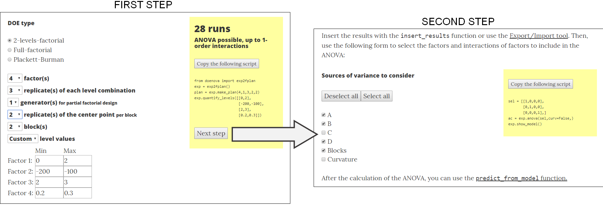
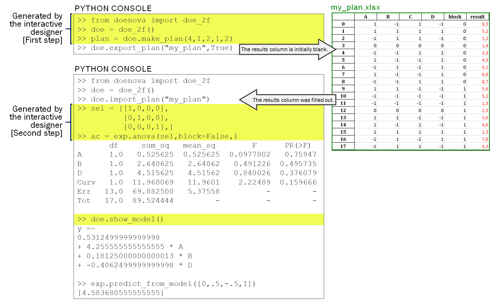

---
title: 'DOENOVA: Simple DOE and ANOVA package for Python 3'
tags:
  - DOE
  - ANOVA
  - Python
  - N-way ANOVA
authors:
  - name: Francis B. Lavoie
    affiliation: 1
  - name: Ryan Gosselin
    affiliation: 1
affiliations:
 - name: Universite de Sherbrooke, Faculty of Engineering, Department of Chemical & Biotechnological Engineering, 2500 boul. de l'Universite, Sherbrooke, QC, Canada, J1K 2R1
   index: 1
date: 15 July 2019
bibliography: references.bib
---

# Summary

DOENOVA is a Python3 package to easily create typical design of experiments (DOE), from which analysis of variance (ANOVA) models can then be calculated. This high-level package requires the users to only write a few lines of codes and its features and performances are comparable to commercial software. A website has also been developed in which an interactive designer interface allows to select the DOE parameters in order to automatically generate the needed Python code.

# Motivations

Design of experiments (DOE) are very common, both in the research and the industrial fields [@montgomery2017design]. Thanks to their intrinsic orthogonality [@plackett1946design], DOEs make it possible to minimize the number of experiments to perform and lead to meaningful results using analyses of variance (ANOVA). 

Well-known commercial software allow users to make DOEs, to insert responses and to calculate ANOVA tables through simple user interfaces [@montgomery2017design]. These software have a lot of additional analysis options, but their main use remains the calculation of ANOVA tables. 

Some packages written in open-source programming languages allow users to create DOEs, such as *pyDOE2* for Python [@baudin2015pydoe], or to calculate ANOVA, such as Python's *Statmodels* package [@perktold2017statsmodels]. However, no high-level packages allowing both the creation of DOEs and the calculation of ANOVA have been made available. Even commercial high-level programming interfaces, such as Matlab [@mathworks2005statistics; martinez2015computational], do not have this capability. In response to this lack, we have created a Python's package, named DOENOVA, whose primary objective is to ease the creation of DOEs followed by the calculation of ANOVA tables within the most widely adopted open-source and high-level programming interface, namely Python 3 [@oliphant2007python].

# Integration of existing packages

We developed a wrap-up to combine pyDOE2’s (version 1.2.0) capacity of creating DOEs and Statsmodels’ (version 0.10.0) ability of calculating ANOVA tables, leading to the DOENOVA Python package. This wrap-up is in object-oriented programming in which the user creates an experimental design object. From this object, the user parametrizes the design, inserts the results and calculates the ANOVA model with a minimum number of lines of codes.

Baudin's pyDOE2 package [@baudin2015pydoe] allows users to create an experimental design according to a selected DOE type and a specific number of factors. This package was used in DOENOVA to create General full-factorial and Plackett-Burman factorial designs. For complete and fractional 2-level factorial designs, we have included our own codes into the DOENOVA package. We also added the capacity to add blocks and center points which is not possible with pyDOE2.

Through its ordinary least squares (OLS) function, the Statsmodels package, created by Perktold, Seabold and Taylor @perktold2017statsmodels, allows to calculate N-way ANOVAs. From our experience, this package may be cumbersome when selecting specific factors or interactions of factors to include in the ANOVA as the nomenclature of the command lines was not intuitive. Moreover, Statsmodels cannot deal with blocks and center points.

The most important work in the development of the DOENOVA package was to automate the use of Statsmodels’ ANOVA function depending of the selected factors and interactions of factors. As neither pyDOE2 nor Statsmodels has the capacity of dealing with blocks and center points, another important part of the project was to make possible the integration of such features into the creation of designs and the calculation of ANOVA tables.

# Website

In parallel to package development, we also developed a website ([doenova.tripli.ca](http://doenova.tripli.ca)) to provide package documentation. The website also contains an interactive designer in which the users can interactively modify the design parameters: DOE type, number of factors, number of replicates, number of blocks and number of center points. By changing a parameter, the webpage automatically calculates and displays the required total of runs and determines if an ANOVA can be calculated. A Python code, to copy in any Python console, is also generated according to the selected parameters. 

**Figure 1**. Web interactive designer generating Python codes. In the first step, the user can change DOE parameters. From any parameter change, the required number of runs is automatically updated and the possibility, or not, of calculating an ANOVA is shown. In the second step, the user can select which factors and interactions of factors to include in the model.

Once the design parameters have been selected and the experiments performed, the interactive webpage also proposes a form to select which factors, and their interactions, must be considered in the ANOVA model. Again, the Python code is automatically generated.

# Current features

So far, DOENOVA can handle general full-factorial, Plackett-Burman and 2-level factorial designs. The 2-level factorial design can either be full or fractional. For fractional designs, the generators are automatically and optimally created by the DOENOVA package in order to maximize plan resolution. As mentioned, DOENOVA can also handle blocks and center points.

By default, level values are coded in terms of -1, 1 and 0 (for center points) in 2-level and Plackett-Burman factorial designs. The user can replace these default values. For this, the interactive designer form page eases the task as it provides an easy-to-use interface to modify the default values from which the Python code is automatically generated.

**Figure 2**. Python consoles and *xlsx* file. The user first copies and pastes the Python code generated by the interactive designer's first step. The user then exports the plan and fills out the result column in Libre Office Calc (or Microsoft Excel). The user then imports the filled out xlsx file and copies and pastes the Python code generated by the interactive designer's second step.

Once parametrized, the DOE can be exported as a table into an *xlsx* file, which can be opened by Libre Office Calc or Microsoft Excel. While exporting, the user can choose to randomize the runs. A blank results column is automatically added to the DOE table found in the *xlsx* file. The users can then fill this column through the experiments.

Once the experiments are completed, the *xlsx* file can be reimported with the DOENOVA package. The ANOVA can then be calculated. The user can choose to either calculate a full ANOVA table or to only consider some factors or interactions of factors. Again, the *interactive designer* webpage can ease this task. A response predictive model is also calculated according to the selected factors and interactions of factors.  This model can then be used to predict responses from given factor values.

# Future work
DOENOVA is currently limited to 3 DOE types. Based on the DOEANOVA structure, we are working to add more types of design for the package, such as the 3-level factorial design, as well as adding them to the *interactive designer* webpage. 

We are also working on a DOE optimizer which would provide the optimal DOE to the user according to a maximum number of runs and the DOE objective.

# References
